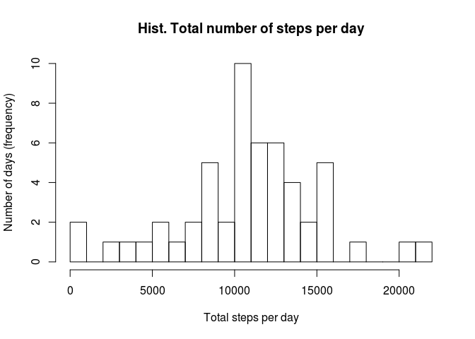
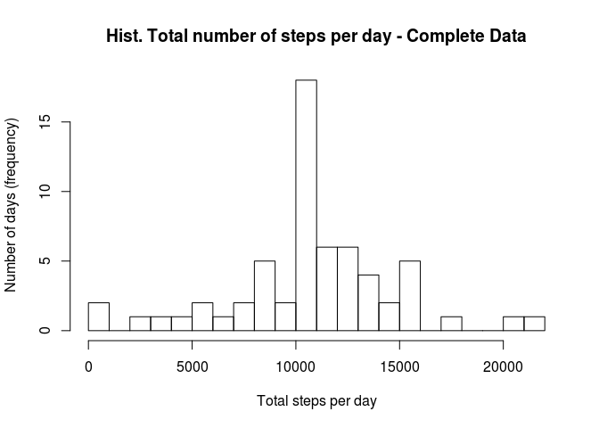
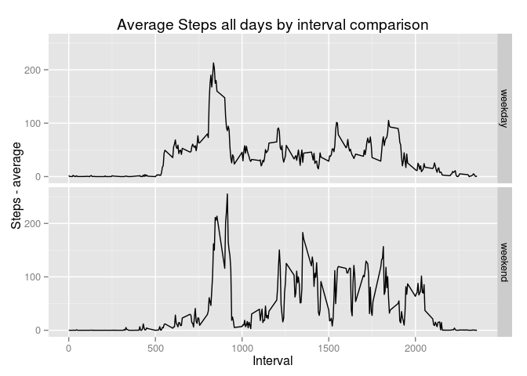

# Reproducible Research: Peer Assessment 1
Goulart, A.  


## Loading and preprocessing the data
Set working directory, url and zip file name

```r
setwd("~/MEOCloud/R/ReproducibleResearch/RepData_PeerAssessment1")
url <- "https://d396qusza40orc.cloudfront.net/repdata/data/activity.zip"
fname <- "activity.zip"
```

Download, unzip and read, converting date to class date and interval to factor

```r
if (!file.exists(fname)) {
  download.file(url, destfile = fname, method = "curl")
}
if (!file.exists("activity.csv")) {
  unzip(fname)
}
activityData <- read.csv ("activity.csv", colClasses = c("numeric", "Date", "numeric"))
```

## Mean total number of steps taken per day
Histogram of the total number of steps taken each day

```r
totalSteps_pDay <- tapply(activityData$steps, activityData$date, sum, simplify = TRUE)
hist(totalSteps_pDay, main = "Hist. Total number of steps per day", xlab = "Total steps per day", ylab="Number of days (frequency)")
```

 

Mean of the total number of steps per day

```r
mean(totalSteps_pDay, na.rm = T)
```

```
## [1] 10766.19
```

Median of the total number of steps per day

```r
median(totalSteps_pDay, na.rm = T)
```

```
## [1] 10765
```

## Average daily activity pattern
Average number of steps vs intervals for all days

```r
avgSteps5minInterv <- aggregate(steps ~ interval, activityData, function (x) {mean(x, na.rm = TRUE)})
avgSteps5minInterv <- avgSteps5minInterv [order(as.numeric(avgSteps5minInterv$interval)),]
plot(avgSteps5minInterv$interval, avgSteps5minInterv$steps, type = "l", main = "Average num. of steps all days", xlab="Interval (hour part)", ylab="Average steps", axes=FALSE)
axis(1, seq(0, 2400, 100), seq(0, 24, 1))
axis(2)
```

 

Interval containing the maximum number of average steps across all days

```r
avgSteps5minInterv[avgSteps5minInterv$steps == max(avgSteps5minInterv$steps),"interval"]
```

```
## [1] 835
```

## Imputing missing values
Total number of rows with NAs

```r
sum(!complete.cases(activityData))
```

```
## [1] 2304
```

Fill in NA values

```r
actDataComplete <- activityData
for (j in 1:nrow(actDataComplete)) {
  if (is.na(actDataComplete[j,"steps"])) {
    actDataComplete[j, "steps"] <- avgSteps5minInterv[avgSteps5minInterv$interval == actDataComplete[j,"interval"], "steps"]
  }
}
```

Histogram of the total number of steps taken each day for complete data

```r
totalSteps_complData <- tapply(actDataComplete$steps, actDataComplete$date, sum, simplify = TRUE)
hist(totalSteps_complData, main = "Hist. Total number of steps per day - Complete Data", xlab = "Total steps per day", ylab="Number of days (frequency)")
```

 

Comparing this  histogram with the one above, we may conclude that the impact of missing data on estimates of the total daily number of steps is not very significant, but noticeable.


Mean of the total number of steps per day for complete data

```r
mean(totalSteps_complData)
```

```
## [1] 10766.19
```
(Same value as for incomplete data above)


Median of the total number of steps per day for complete data

```r
median(totalSteps_complData)
```

```
## [1] 10766.19
```
(Median is now higher than the mean for incomplete data above)

## Are there differences in activity patterns between weekdays and weekends?

```r
actDataComplete$weekday = ifelse(weekdays(actDataComplete$date, abbreviate = TRUE) == "Sáb" | weekdays(actDataComplete$date) == "Dom", "weekend", "weekday")
actDataComplete$weekday <- as.factor(actDataComplete$weekday)

avgSteps <- aggregate(steps ~ weekday + interval, actDataComplete, mean)
avgSteps <- avgSteps [order(avgSteps$weekday, as.numeric(avgSteps$interval)),]

library(ggplot2)
p <- ggplot (data = actDataComplete, aes(x = interval, y = steps))
print (p + facet_grid(. ~ weekday) +
  #geom_point(shape=1) +
  geom_line(aes(group=weekday)) +
  ggtitle ("Average Steps all days by interval comparison") +
  ylab("Steps - average") +
  xlab("Interval"))
```

 

